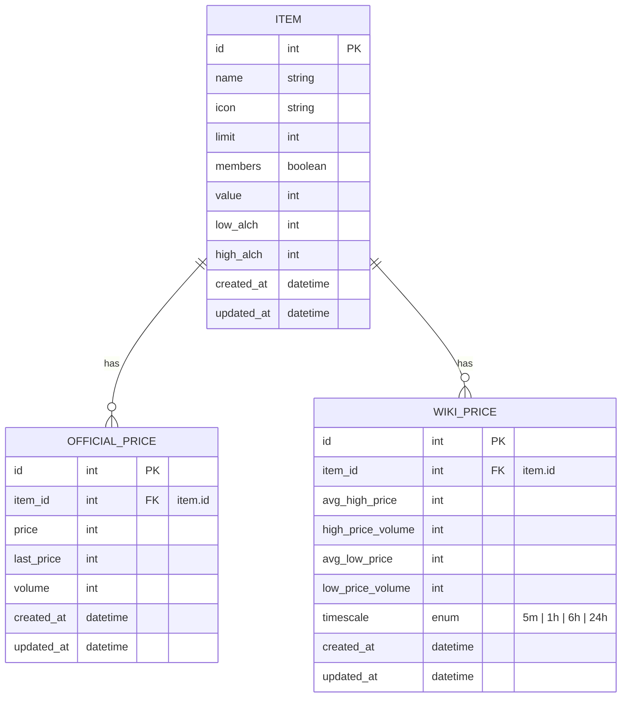

# ERD

```mermaid
erDiagram
    ITEM ||--o{ OFFICIAL_PRICE : has
    ITEM ||--o{ WIKI_PRICE : has

    ITEM {
        id int PK
        name string
        icon string
        limit int
        members boolean
        value int
        low_alch int
        high_alch int

        created_at datetime
        updated_at datetime
    }

    OFFICIAL_PRICE {
        id int PK
        item_id int FK "item.id"
        price int
        last_price int
        volume int

        created_at datetime
        updated_at datetime
    }

    WIKI_PRICE {
        id int PK
        item_id int FK "item.id"
        avg_high_price int
        high_price_volume int
        avg_low_price int
        low_price_volume int
        timescale enum "5m | 1h | 6h | 24h"

        created_at datetime
        updated_at datetime
    }

```
